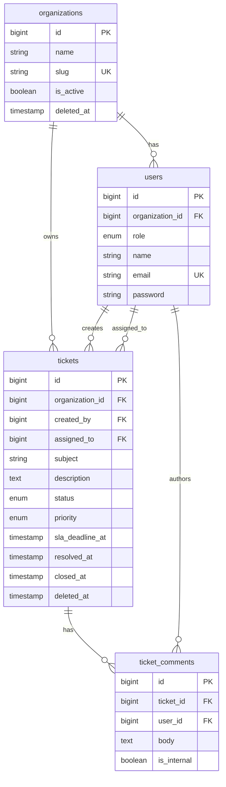

# Support Ticket API

Laravel REST API for a multi-organization support ticket portal. Provides authentication, ticket lifecycle management, SLA tracking, organization management, and threaded comments with internal notes.

**Companion frontend:** [support-ticket-frontend](https://github.com/your-org/support-ticket-frontend) (React SPA)

**Stack:** PHP 8.3+, Laravel 13, Sanctum, MySQL/MariaDB, Pest

---

## Project Overview

This API powers a Support Ticket Portal where:

- **Client users** create and track tickets for their organization, add public comments, and view SLA status.
- **Support agents** manage tickets across all organizations, assign work, update status/priority, and maintain internal notes that are never exposed to clients.

The backend follows a layered architecture aligned with the repository pattern used in the translation-service project:

```
HTTP Request
  → SanitizeInput middleware
  → Rate limiting (auth: 5/min, api: 60/min)
  → Form Request validation
  → Controller (authorize + orchestrate)
  → Service (business rules, transactions, SLA)
  → Repository (data access, scoped queries)
  → API Resource + ApiResponse envelope
```

**Design principles:** SOLID, DRY, KISS, separation of concerns, thin controllers, no raw Eloquent in API responses.

---

## Tech Stack

| Layer | Technology |
|-------|------------|
| Framework | Laravel 13 |
| Auth | Laravel Sanctum (Bearer tokens) |
| Database | MySQL 8+ / MariaDB (SQLite in-memory for tests) |
| Testing | Pest 4 |
| API docs | Postman collection (`docs/postman/`) |

---

## Architecture Overview

| Layer | Responsibility |
|-------|----------------|
| **Controllers** | Validate input, authorize via Policies, delegate to Services, return standardized JSON |
| **Services** | Business rules, DB transactions, SLA logic, status transitions |
| **Repositories** | Eloquent data access, query scoping, filter logic |
| **Policies** | Role- and resource-based authorization |
| **Form Requests** | Input validation rules |
| **API Resources** | Response shaping; hide sensitive/internal fields |
| **Enums** | Domain types: roles, statuses, priorities, SLA states |

Business logic lives in Services. Repositories handle persistence only. Controllers do not contain domain rules.

---

## Folder Structure

```
app/
├── Contracts/                          # Repository interfaces
│   ├── BaseInterface.php
│   ├── SoftDeletableRepositoryInterface.php
│   ├── OrganizationRepositoryInterface.php
│   ├── TicketRepositoryInterface.php
│   ├── UserRepositoryInterface.php
│   └── CommentRepositoryInterface.php
├── Repositories/                       # Eloquent implementations
│   ├── BaseRepository.php
│   ├── SoftDeletableRepository.php
│   ├── OrganizationRepository.php
│   ├── TicketRepository.php
│   ├── UserRepository.php
│   └── CommentRepository.php
├── Services/
│   ├── TicketService.php
│   ├── OrganizationService.php
│   ├── CommentService.php
│   └── SlaService.php
├── Models/
│   ├── Organization.php                # SoftDeletes
│   ├── User.php
│   ├── Ticket.php                      # SoftDeletes
│   └── TicketComment.php
├── Enums/
│   ├── UserRole.php
│   ├── TicketStatus.php
│   ├── TicketPriority.php
│   └── SlaStatus.php
├── Policies/
│   ├── TicketPolicy.php
│   ├── OrganizationPolicy.php
│   └── CommentPolicy.php
├── Http/
│   ├── Controllers/Api/V1/
│   ├── Middleware/SanitizeInput.php
│   ├── Requests/Api/V1/
│   └── Resources/
├── Helpers/ApiResponse.php
├── Exceptions/
└── Providers/AppServiceProvider.php    # DI bindings + rate limiters

routes/
├── api.php                             # Prefix v1
└── api/v1.php                          # All v1 endpoints

database/
├── migrations/
└── seeders/DatabaseSeeder.php

docs/postman/
└── Support-Ticket-Portal.postman_collection.json

tests/Feature/Api/V1/
```

Interfaces live in `app/Contracts/` (not nested under `Repositories/`) to match the translation-service convention and Laravel's own `Contracts` namespace pattern.

---

## Database Design

### ERD



### Tables

| Table | Purpose |
|-------|---------|
| `organizations` | Tenant organizations (soft-deletable) |
| `users` | Client and support agent accounts |
| `tickets` | Support requests with status, priority, SLA deadline (soft-deletable) |
| `ticket_comments` | Public comments and internal notes |
| `personal_access_tokens` | Sanctum API tokens |

**Normalization:** 3NF — relationships via foreign keys; no duplicated org/user data on tickets. `sla_deadline_at` is stored at creation for efficient overdue filtering.

**Indexes:** Foreign keys on `organization_id`, `created_by`, `assigned_to`, `ticket_id`, `user_id`. Unique constraints on `organizations.slug` and `users.email`.

---

## Authentication Strategy

- **Laravel Sanctum** personal access tokens (Bearer).
- `POST /api/v1/auth/login` → returns `token`, `token_type`, `user`.
- Authenticated routes require `Authorization: Bearer {token}`.
- `POST /api/v1/auth/logout` revokes the current token.
- `GET /api/v1/auth/me` returns the authenticated user with organization.

### Seeded accounts

| Role | Email | Password |
|------|-------|----------|
| Support Agent | `agent@support.local` | `password` |
| Client (Acme) | `client@acme.local` | `password` |
| Client (Globex) | `client@globex.local` | `password` |

---

## Authorization Strategy

Policies enforce access at the controller layer. Repositories apply query-level scoping as a second line of defense.

| Action | Client | Agent |
|--------|--------|-------|
| View own org tickets | Yes | Yes (all orgs) |
| View other org tickets | No | Yes |
| Create ticket | Own org | Any org |
| Update ticket | Open tickets only | Yes |
| Change status / assign | No | Yes |
| Delete ticket | No | Yes (open only) |
| Manage organizations | No | Yes |
| View internal notes | No | Yes |
| Create internal notes | No (silently public) | Yes |

Internal notes are filtered in `CommentRepository::listForTicket` for client users. Clients sending `is_internal: true` have it silently forced to `false` in `CommentService`.

---

## Repository Pattern

Interfaces live in `app/Contracts/`. Eloquent implementations live in `app/Repositories/`, with centralized error handling via `execute()`.

| Contract | Implementation | Notes |
|----------|----------------|-------|
| `BaseInterface` / `BaseRepository` | User, Comment repos | `all`, `findById`, `create`, `update` |
| `SoftDeletableRepositoryInterface` / `SoftDeletableRepository` | Organization, Ticket repos | Adds `delete`, `restore`, `forceDelete` |

Bindings in `AppServiceProvider`:

- `OrganizationRepositoryInterface` → `OrganizationRepository`
- `UserRepositoryInterface` → `UserRepository`
- `TicketRepositoryInterface` → `TicketRepository`
- `CommentRepositoryInterface` → `CommentRepository`

Services depend on interfaces, not concrete classes. Validated request data is passed as arrays — no separate DTO layer. Filter and query logic lives in repositories.

---

## SLA Rules

SLA deadlines are calculated in `SlaService` at ticket creation. Priority changes recalculate the deadline from the original `created_at`.

| Priority | Resolution Window | Due Soon Threshold |
|----------|-------------------|--------------------|
| Low | 72 hours | ≤ 18 hours remaining |
| Medium | 48 hours | ≤ 12 hours remaining |
| High | 24 hours | ≤ 6 hours remaining |

### SLA Status (computed at response time)

| Status | Condition |
|--------|-----------|
| `on_track` | Before due-soon threshold |
| `due_soon` | Within threshold, not past deadline |
| `overdue` | Past deadline, not resolved/closed |
| `met` | Resolved/closed before deadline |
| `breached` | Resolved/closed after deadline |

### Ticket status transitions

```
open → in_progress | resolved | closed
in_progress → waiting_on_client | resolved | closed
waiting_on_client → in_progress | resolved | closed
resolved → closed
closed → (terminal)
```

---

## API Versioning

All endpoints are under `/api/v1/`. Future versions can be added via `routes/api/v2.php` without modifying v1.

---

## API Response Format

### Success

```json
{
  "success": true,
  "message": "Ticket created successfully.",
  "data": {}
}
```

### Paginated

```json
{
  "success": true,
  "message": "Tickets retrieved successfully.",
  "data": [],
  "meta": {
    "current_page": 1,
    "per_page": 15,
    "total": 42,
    "last_page": 3
  }
}
```

### Validation Error (422)

```json
{
  "success": false,
  "message": "The given data was invalid.",
  "errors": {
    "subject": ["The subject field is required."]
  }
}
```

---

## API Endpoints

| Method | Endpoint | Description |
|--------|----------|-------------|
| GET | `/api/v1/health` | Health check |
| POST | `/api/v1/auth/login` | Login (5 req/min) |
| POST | `/api/v1/auth/logout` | Logout |
| GET | `/api/v1/auth/me` | Current user |
| GET | `/api/v1/users/agents` | List support agents |
| GET | `/api/v1/organizations` | List organizations |
| POST | `/api/v1/organizations` | Create organization |
| GET | `/api/v1/organizations/{id}` | Show organization |
| PUT | `/api/v1/organizations/{id}` | Update organization |
| DELETE | `/api/v1/organizations/{id}` | Soft delete organization |
| GET | `/api/v1/tickets` | List tickets (filterable, paginated) |
| POST | `/api/v1/tickets` | Create ticket |
| GET | `/api/v1/tickets/{id}` | Show ticket |
| PUT | `/api/v1/tickets/{id}` | Update ticket |
| DELETE | `/api/v1/tickets/{id}` | Soft delete ticket |
| PATCH | `/api/v1/tickets/{id}/status` | Status transition |
| PATCH | `/api/v1/tickets/{id}/assign` | Assign agent |
| GET | `/api/v1/tickets/{id}/comments` | List comments |
| POST | `/api/v1/tickets/{id}/comments` | Create comment/note |

### Ticket list filters (query params)

`status`, `priority`, `organization_id`, `assigned_to`, `unassigned`, `search`, `sla_status`, `per_page`

---

## Setup Instructions

### Prerequisites

- PHP 8.3+, Composer
- MySQL 8+ or MariaDB

### Install and run

```bash
composer install
cp .env.example .env
php artisan key:generate
```

Configure `.env`:

```env
DB_CONNECTION=mysql
DB_HOST=127.0.0.1
DB_PORT=3306
DB_DATABASE=support_ticket_portal
DB_USERNAME=root
DB_PASSWORD=
```

```bash
php artisan migrate --seed
php artisan serve
```

API available at `http://localhost:8000/api/v1`.

---

## Running Tests

```bash
php artisan test
```

Tests use in-memory SQLite. Coverage includes:

- Authentication (login, logout)
- Authorization (cross-org access, client scoping)
- Internal note visibility
- SLA calculation and `sla_status` exposure
- Ticket and comment API flows

**Current status:** 17 tests, 43 assertions — all passing.

---

## Postman Collection

Import `docs/postman/Support-Ticket-Portal.postman_collection.json`.

1. Set `base_url` to `http://localhost:8000/api/v1`.
2. Run **Login (Agent)** or **Login (Client)** — the test script stores the token automatically.
3. Execute authenticated requests.

---

## Assumptions

- Two roles: `client` and `support_agent` (no separate admin).
- Support agents are global (not tied to a single organization).
- Clients belong to exactly one organization.
- File attachments, email notifications, and audit logs are out of scope.
- Ticket reopening from `closed` is not implemented.
- Organization delete is blocked when non-deleted tickets still exist.

---

## Trade-offs

| Decision | Rationale |
|----------|-----------|
| Stored `sla_deadline_at` | Efficient overdue filtering without per-row runtime computation |
| Silent stripping of `is_internal` for clients | Prevents leaking internal-note capability |
| `Contracts/` instead of `Repositories/Interfaces/` | Matches translation-service and Laravel conventions |
| No DTO layer | Form Request `validated()` arrays are sufficient at this scale |
| SQLite in tests | Fast, zero-config CI-friendly runs |
| ApiResponse envelope | Consistent client parsing across all endpoints |
| Soft deletes on orgs/tickets | Safer production deletes without cascade complexity |

---

## Time Spent

Approximately 4 hours for API architecture, implementation, tests, and documentation.

---

## Known Limitations

- No email/notification pipeline.
- No file attachments on tickets or comments.
- SLA filter queries assume application default timezone.
- Organization delete blocked when active tickets exist.
- `restore` / `forceDelete` repository methods exist but are not exposed via API.
- CORS is permissive in local development; tighten for production.

---

## Next Steps

- OpenAPI/Swagger generation from routes and Form Requests.
- Email notifications on assignment, status change, and SLA breach.
- Audit log for agent actions.
- Attachment support with virus scanning.
- Admin role for organization self-service.
- Expose restore endpoints for soft-deleted records.

---

## Production Improvements

- Redis for cache and rate limiting.
- Horizon for queue workers (notifications, SLA alerts).
- Strict CORS origins.
- Database read replicas for reporting.
- Structured logging and APM (Datadog, Sentry).
- CI pipeline with Pest, Pint, and static analysis.
- Docker Compose for local/production parity.

---

## Assessment Compliance

This project was built against the Senior Laravel Engineer technical assessment brief. Summary:

| Requirement | Status |
|-------------|--------|
| Laravel (latest stable) | ✅ Laravel 13 |
| MySQL/MariaDB | ✅ |
| REST API | ✅ |
| Repository Pattern | ✅ Contracts + Repositories + DI |
| Conventional MVC + layered architecture | ✅ |
| translation-service architectural alignment | ✅ Contracts/, flat Repositories/, Services, Policies |
| API versioning `/api/v1/` | ✅ |
| Standardized API responses | ✅ `ApiResponse` helper |
| Sanctum authentication | ✅ |
| Policies for authorization | ✅ Ticket, Organization, Comment |
| Query-level scoping | ✅ `TicketRepository`, `CommentRepository` |
| Form Request validation | ✅ Reusable `TicketRequest`, `OrganizationRequest`, etc. |
| Input sanitization middleware | ✅ `SanitizeInput` |
| Rate limiting | ✅ 5/min login, 60/min API |
| API Resources (no raw models) | ✅ |
| Domain: orgs, users, tickets, comments, SLA, internal notes | ✅ |
| SLA logic in Services only | ✅ `SlaService` |
| Pest tests: auth, SLA, API | ✅ 17 tests |
| Postman collection | ✅ `docs/postman/` |
| Professional README | ✅ This document |

**Intentional deviations (documented):**

- Interfaces in `app/Contracts/` rather than `app/Repositories/Interfaces/` — aligned with translation-service refactor.
- No `Traits/`, `DTOs/`, or `Queries/` folders — removed as over-engineering for this scope; logic consolidated into Services and Repositories.
- React frontend lives in a separate repository.
